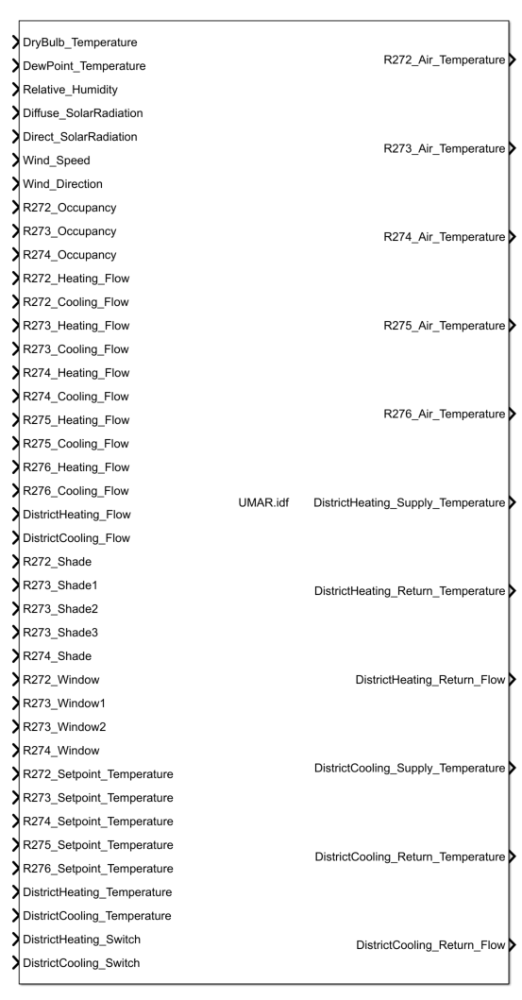
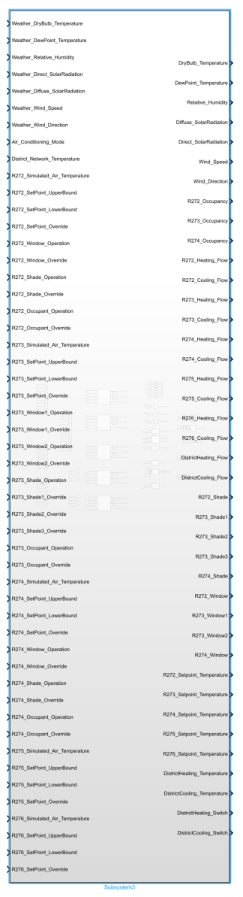
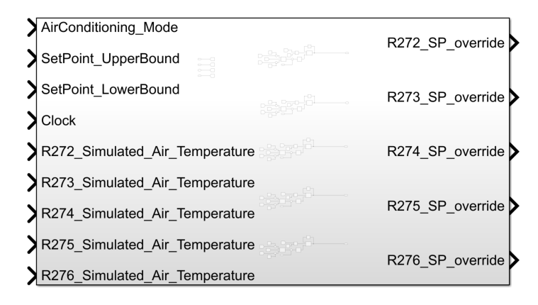

=========
Annex
=========

.. list-table::  The input and outputs of UMAR. (t: current timestep, t-1: previous timestep)
   :widths: 50 50
   :header-rows: 1
   
   * - Inputs	
     - Outputs
   * - DryBulb_Temperature (t)		
     - R272_Air_Temperature (t)
   * - DewPoint_Temperature (t)		
     - R273_Air_Temperature (t)
   * - Relative_Humidity (t)		
     - R274_Air_Temperature (t)
   * - Diffuse_SolarRadiation (t)		
     - R275_Air_Temperature (t)
   * - Direct_SolarRadiation (t)		
     - R276_Air_Temperature (t)
   * - Wind_Speed (t)		
     - DistrictHeating_Supply_Temperature (t)
   * - Wind_Direction (t)		
     - DistrictHeating_Return_Temperature (t)
   * - R272_Occupancy (t)		
     - DistrictHeating_Return_Flow (t)
   * - R273_Occupancy (t)		
     - DistrictCooling_Supply_Temperature (t)
   * - R274_Occupancy (t)		
     - DistrictCooling_Return_Temperature (t)
   * - R272_Heating_Flow (t)		
     - DistrictCooling_Return_Flow (t)
   * - R272_Colling_Flow (t)	
     - 	
   * - R273_Heating_Flow (t)		
     - 
   * - R273_Colling_Flow (t)		
     - 
   * - R274_Heating_Flow (t)		
     - 
   * - R274_Colling_Flow (t)		
     - 
   * - R275_Heating_Flow (t)		
     - 
   * - R275_Colling_Flow (t)		
     - 
   * - R276_Heating_Flow (t)		
     - 
   * - R276_Colling_Flow (t)		
     - 
   * - DistrictHeating_Flow (t)		
     - 
   * - DistrictCooling_Flow (t)		
     - 
   * - R272_Shade (t)		
     - 
   * - R273_Shade1 (t)		
     - 
   * - R273_Shade2 (t)		
     - 
   * - R273_Shade3 (t)		
     - 
   * - R274_Shade (t)		
     - 
   * - R272_Window (t)		
     - 
   * - R273_Window1 (t)		
     - 
   * - R273_Window2 (t)			
     - 
   * - R274_Window (t)		
     - 
   * - R272_SetPoint_Temperature (t)		
     - 
   * - R273_SetPoint_Temperature (t)		
     - 
   * - R274_SetPoint_Temperature (t)		
     - 
   * - R275_SetPoint_Temperature (t)		
     - 
   * - R276_SetPoint_Temperature (t)		
     - 
   * - DistrictHeating_Temperature (t)		
     - 
   * - DistrictCooling_Temperature (t)		
     - 
   * - DistrictHeating_Switch (t)		
     - 
   * - DistrictCooling_Switch (t)		
     - 

    The input and outputs of UMAR.

.. list-table::  The input and outputs of PREPROCESS. (t: current timestep, t-1: previous timestep)
   :widths: 50 50
   :header-rows: 1

   * - Inputs	
     - Outputs
   * - Weather_DryBulb_Temperature (t)		
     - DryBulb_Temperature  (t)
   * - Weather_DewPoint_Temperature (t)		
     - DewPoint_Temperature (t)
   * - Weather_Relative_Humidity (t)		
     - Relative_Humidity (t)
   * - Weather_Diffuse_SolarRadiation (t)		
     - Diffuse_SolarRadiation (t)
   * - Weather_Direct_SolarRadiation (t)		
     - Direct_SolarRadiation (t)
   * - Weather_Wind_Speed (t)		
     - Wind_Speed (t)
   * - Weather_Wind_Direction (t)		
     - Wind_Direction (t)
   * - Air_Conditioning_mode (t)		
     - R272_Occupancy (t)
   * - District_Network_Temperature (t)		
     - R273_Occupancy (t)
   * - R272_Simulated_Air_Temperature (t-1)		
     - R274_Occupancy (t)
   * - R272_SetPoint_UpperBound (t)		
     - R272_Heating_Flow (t)
   * - R272_SetPoint_LowerBound (t)		
     - R272_Colling_Flow (t)
   * - R272_SetPoint_Override (t)		
     - R273_Heating_Flow (t)
   * - R272_Window_Operation (t)		
     - R273_Colling_Flow (t)
   * - R272_Window_Override (t)		
     - R274_Heating_Flow (t)
   * - R272_Shade_Operation (t)		
     - R274_Colling_Flow (t)
   * - R272_Shade_Override (t)		
     - R275_Heating_Flow (t)
   * - R272_Occupant_Operation (t)		
     - R275_Colling_Flow (t)
   * - R272_Occupant_Override (t)		
     - R276_Heating_Flow (t)
   * - R273_Simulated_Air_Temperature (t-1)		
     - R276_Colling_Flow (t)
   * - R273_SetPoint_UpperBound (t)		
     - DistrictHeating_Flow (t)
   * - R273_SetPoint_LowerBound (t)		
     - DistrictCooling_Flow (t)
   * - R273_SetPoint_Override (t)		
     - R272_Shade (t)
   * - R273_Window1_Operation (t)		
     - R273_Shade1 (t)
   * - R273_Window1_Override (t)	
     - R273_Shade2 (t)
   * - R273_Window2_Operation (t)			
     - R273_Shade3 (t)
   * - R273_Window2_Override (t)	
     - R274_Shade (t)
   * - R273_Shade_Operation (t)		
     - R272_Window (t)
   * - R273_Shade1_Override (t)		
     - R273_Window1 (t)
   * - R273_Shade2_Override (t)		
     - R273_Window2 (t)
   * - R273_Shade3_Override (t)		
     - R274_Window (t)
   * - R273_Occupant_Operation (t)		
     - R272_SetPoint_Temperature (t)
   * - R273_Occupant_Override (t)		
     - R273_SetPoint_Temperature (t)
   * - R274_Simulated_Air_Temperature (t-1)		
     - R274_SetPoint_Temperature (t)
   * - R274_SetPoint_UpperBound (t)		
     - R275_SetPoint_Temperature (t)
   * - R274_SetPoint_LowerBound (t)		
     - R276_SetPoint_Temperature (t)
   * - R274_SetPoint_Override (t)		
     - DistrictHeating_Temperature (t)
   * - R274_Window_Operation (t)		
     - DistrictCooling_Temperature (t)
   * - R274_Window_Override (t)		
     - DistrictHeating_Switch (t)
   * - R274_Shade_Operation (t)		
     - DistrictCooling_Switch (t)
   * - R274_Shade_Override (t)		
     - 
   * - R274_Occupant_Operation (t)		
     - 
   * - R274_Occupant_Override (t)		
     - 
   * - R275_Simulated_Air_Temperature (t-1)		
     - 
   * - R275_SetPoint_UpperBound (t)		
     - 
   * - R275_SetPoint_LowerBound (t)		
     - 
   * - R275_SetPoint_Override (t)		
     - 
   * - R276_Simulated_Air_Temperature (t-1)		
     - 
   * - R276_SetPoint_UpperBound (t)		
     - 
   * - R276_SetPoint_LowerBound (t)		
     - 
   * - R276_SetPoint_Override (t)		
     - 

    
    The input and outputs of PREPROCESS.

.. list-table::  The input and outputs of FMUCTRL. (t: current timestep, t-1: previous timestep)
   :widths: 50 50
   :header-rows: 1

   * - Inputs	
     - Outputs
   * - AirConditioning_Mode (t)		
     - R272_SP_Override (t)
   * - SetPoint_UpperBound (t)		
     - R273_SP_Override (t)
   * - SetPoint_LowerBound (t)		
     - R274_SP_Override (t)
   * - Clock (t)		
     - R275_SP_Override (t)
   * - R272_Simulated_Air_Temperature  (t-1)		
     - R276_SP_Override (t)
   * - R273_Simulated_Air_Temperature (t-1)		
     - 
   * - R274_Simulated_Air_Temperature (t-1)		
     - 
   * - R275_Simulated_Air_Temperature (t-1)		
     - 
   * - R276_Simulated_Air_Temperature (t-1)		
     - 

    The input and outputs of FMUCTRL.

