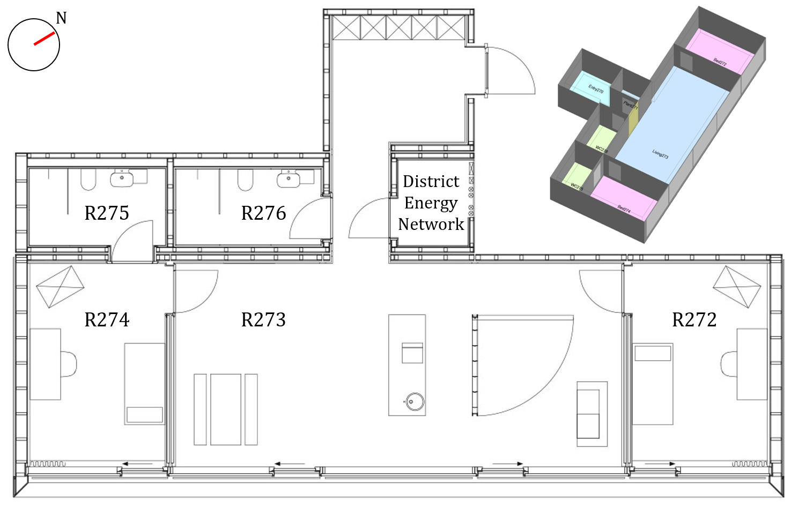

=======================
Components
=======================

Simulators
===========

*nestli* is composed of a number of simulators that communicate data at each time step. The dependencies among simulators are set in the config file (example_config.yml). Figure 1 shows an example of dependency between the simulators based on the example_config.yml located in:

nestli/example/python_controller/example_config.yml

It is important to note that some inputs to a simulator may have circular dependency. Namely, the input to a simulator depends on the outputs from another simulator at the previous time step. For instance in Figure 1, the input from UMAR to PyCTRL is from the previous time step. In Figure 1, such inputs are annotated by (t-1). 

    A map of dependencies between simulators. This figure explicitly refers to the dependencies between simulators as in the python_controller example.

In the following, each simulator is described in detail:

**COLLECTOR:** This python function retains the outputs from other simulators at each time-step and saves them into a csv (comma separated value) file at the end of the run. COLLECTOR does not produce any outputs during the run.

**ConstantValue:** This python function produces a signal with a fixed value. It is particularly useful for parametric or simulation studies when the user desires an input signal with a fixed value.

**TabularDataSimPandas:** This python function reads the values in the hdf5 files at every time-step and assigns them to the correct input port. Users can override the \*.h5 files to manipulate the input signals. However, for some variables (as described in FmuAdapter), users can generate the signals on-the-fly and override the \*.h5 values.

**FmuAdapter:** This python function uses the FMPy library to load FMUs into the nestli environment. 

**NanPlaceholder:** This python function generates a NaN signal. It is useful when the user DOES NOT want to override a variable during simulation, thus providing the override port with a NaN signal.

**PythonFunction:** This python function reads a python-based controller that is written into a python template. A simple implementation of a python based controller can be found in nestli/example/python_controller/PythonController.py

Resources
===========

Data
------

*nestli's* data is based on measurements from the Urban Mining and Recycling (UMAR) unit of the NEST demonstrator at Empa [1]. UMAR is a residential unit (i.e. a flat) with two bedrooms, two bathrooms and one living room/kitchen. The flat is home to two occupants, each with one bedroom while sharing the living/cooking space. The source of air conditioning for the UMAR unit is provided by central heating and cooling networks that operate at 36℃ and 16℃, respectively. nestli's data are either directly measured from the sensors or inferred from measurements during the calibration process. Description of the input data is provided in Table 1. The measured/inferred data spans three years from 2019 to 2021. The measurements are collected at 1-minute intervals. The geometric characteristics of the UMAR unit is displayed in Figure 2. In the nestli environment, the data are stored in HDF5 format at the following path
nestli/src/nestli/simulators/resources/data

    Plan and axonometric view of the UMAR unit.

.. list-table:: Description of the input variables
   :widths: 35 65
   :header-rows: 0

   * - Weather_DryBulb_Temperature	
     - Measured on-site outdoor dry-bulb temperature (℃)
   * - Weather_DewPoint_Temperature	
     - Measured on-site outdoor dew-point temperature (℃)
   * - Weather_Relative_Humidity		
     - Measured on-site outdoor relative humidity (%)
   * - Weather_Diffuse_SolarRadiation		
     - Calculated diffuse horizontal irradiance from on-site measurements of global horizontal radiation (W/m^2 )
   * - Weather_Direct_SolarRadiation		
     - Calculated direct normal irradiance from on-site measurements of global horizontal radiation (W/m^2 )
   * - Weather_Wind_Speed	
     - Measured outdoor wind speed (m/s^2 )
   * - Weather_Wind_Direction		
     - Measured outdoor wind direction (°)
   * - Air_Conditioning_mode		
     - Heating (+1) or cooling (–1) state of the air conditioning system based on measurements of the district network temperature.
   * - District_Network_Temperature		
     - Measured district network fluid temperature (℃)
   * - R272_SetPoint_UpperBound		
     - Nominal upper limit of the comfort bound (℃)
   * - R272_SetPoint_LowerBound		
     - Nominal lower limit of the comfort bound (℃)
   * - R272_Window_Operation		
     - Measured window operation
   * - R272_Shade_Operation		
     - Inferred shading operation from measurements of indoor illuminance values
   * - R272_Occupant_Operation		
     - Inferred internal heat gain from electricity consumption (W)
   * - R273_SetPoint_UpperBound		
     - Nominal upper limit of the comfort bound (℃)
   * - R273_SetPoint_LowerBound		
     - Nominal lower limit of the comfort bound (℃)
   * - R273_Window1_Operation		
     - Measured window operation
   * - R273_Window2_Operation		
     - Measured window operation
   * - R273_Shade_Operation		
     - Inferred shading operation from measurements of indoor illuminance values
   * - R273_Occupant_Operation		
     - Inferred internal heat gain from electricity consumption  (W)
   * - R274_SetPoint_UpperBound		
     - Nominal upper limit of the comfort bound (℃)
   * - R274_SetPoint_LowerBound		
     - Nominal lower limit of the comfort bound (℃)
   * - R274_Window_Operation		
     - Measured window operation
   * - R274_Shade_Operation		
     - Inferred shading operation from measurements of indoor illuminance values
   * - R274_Occupant_Operation		
     - Inferred internal heat gain from electricity consumption  (W)
   * - R275_SetPoint_UpperBound		
     - Nominal upper limit of the comfort bound (℃)
   * - R275_SetPoint_LowerBound		
     - Nominal lower limit of the comfort bound (℃)
   * - R276_SetPoint_UpperBound		
     - Nominal upper limit of the comfort bound (℃)
   * - R276_SetPoint_LowerBound		
     - Nominal lower limit of the comfort bound (℃)

FMUs
------
Currently, there are three FMUs in nestli. The first two are UMAR and PREPROCESS, both of which are integral for executing a simulation. These FMUs are stored at:
nestli/src/nestli/simulators/resources/fmu

1.	UMAR is an EnergyPlus input file (\*.idf) which is wrapped into an FMU by using LBNL's EnergyPlusToFMU software [2]. UMAR is based on FMI Version 2.0 (See Annex 1).

2.	PREPROCESS is created in Simulink and wrapped into an FMU by the Matlab/Simulink FMU compiler. PREPROCESS ensures that inputs to UMAR are within reasonable ranges and thus reduces the chances of encountering a fatal error when running the simulation (see Annex 2). PREPROCESS has a baked-in hysteresis controller, which actuates based on the upper and lower thermal comfort bounds. PREPROCESS also has provisions for overriding some variables on the fly during the simulation. The names of these variables always end in “_Override” (e.g., R272_Occupant_Override, R273_Shade_Override, R274_Shade_Override, R275_SetPoint_Override, etc.). The source Simulink file of PREPROCESS is stored at:
        nestli/fmu_source_files

The third FMU is specifically created as an example and therefore stored at:

3.	FMUCTRL is created in Simulink and wrapped into an FMU by the Matlab/Simulink FMU compiler. FMUCTRL is an example of how any controller can be wrapped into an FMU and imported into nestli. The current example of FMUCTRL keeps the indoor air temperature near the lower comfort bound during the heating season and near the upper comfort bound during the cooling season (see Annex 3). The source Simulink file of FMUCTRL is stored at:
        nestli/fmu_source_files
