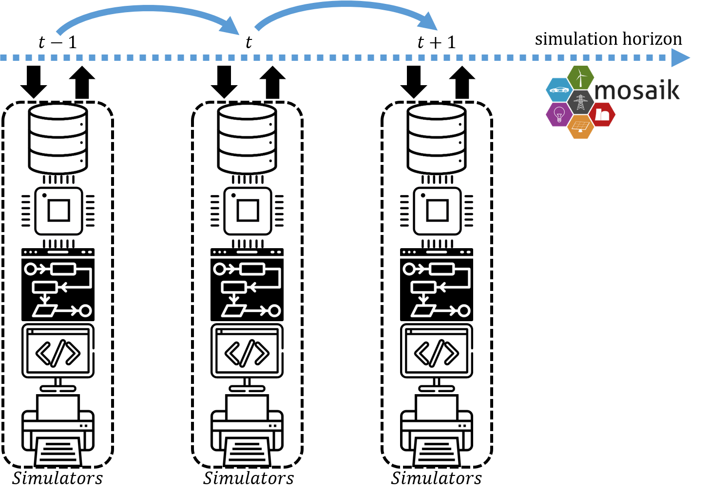

=======================
Simulation execution
=======================

*nestli* uses the Mosaik [3] Python library to coordinate the co-simulation between simulators. A graphical representation of the simulation run is provided in Figure 2.

    Co-simulation management by Mosaik. Details of the simulators are provided in Section Components (Figure 1).

Mosaik manages the co-simulation by assigning the correct input data to the relevant input port of simulators at the right time step. Thus, the communication between the simulators during the run is also coordinated by Mosaik. The temporal resolution of nestli simulations is set to 1 minutes due to settings in the EnergyPlus model of UMAR (idf file). As a result, Mosaik manages communications at a sampling time of 1-minute. The PREPROCESS simulator is tightly integrated with the UMAR simulator, and therefore, should also use a 1-minue sampling time. Other simulators can be configured to execute at time-steps other than (and down to) 1-minutes.