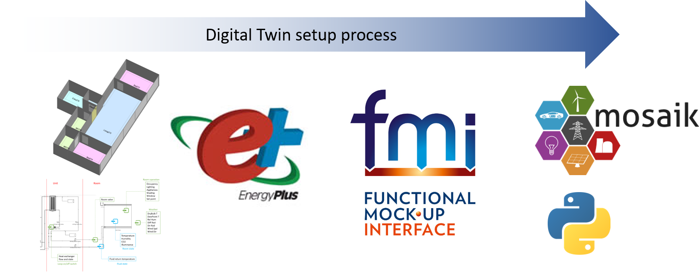
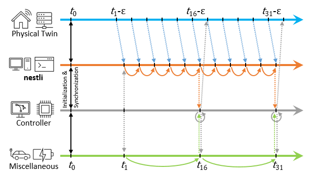

=================
nestli README
=================

nestli (Neighborhood Energy System Testing towards Large-scale Integration)
==============================================================================
nestli is the virtual sister of the NEST demonstrator at Empa. It is co-simulation environment for benchmarking the performance of BACS (building automation and control systems). In its core, nestli is a calibrated EnergyPlus model of the UMAR living lab. see: https://www.empa.ch/web/nest/urban-mining

The calibrated EnergyPlus model is wrapped into an FMU (fucntional mock-up unit) using the EnergyPlusToFMU tool. see: https://simulationresearch.lbl.gov/fmu/EnergyPlus/export/

The model is calibrated on measurements that are collected at 1-minute intervals, and thus runs at the same temporal resolution. The HVAC system can be controlled by overriding the setpoint temperature in each room. It is also possible to evaluate the robustness of the controller by manipulating weather conditions and building operation.

Installation
================
The installation consists of 3 Steps.

#. install EnergyPlus
#. install Python
#. install the nestli package

Further installation informations are in the pdf documentation. Container-based implementation is also provided using Docker.

Usage
================
A simple example of how to use the package is given in the **example** folder. Just run the file nestli_example_run.py where the config example_config.yml specifies all the parameters.

Citation
==========
If you use our tool for your work, please cite the following paper:

Khayatian, F.; Cai, H.; Bojarski, A.; Heer, P.; Bollinger A.; Benchmarking HVAC controller performance with a digital twin. Applied Energy Symposium: Clean Energy towards Carbon Neutrality (CEN2022). https://www.enerarxiv.org/page/thesis.html?id=3819
